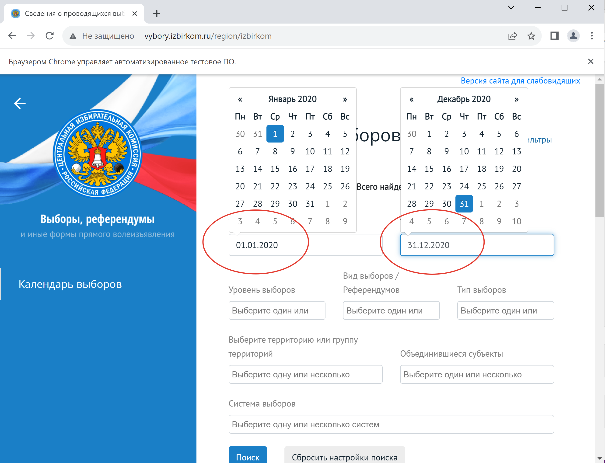
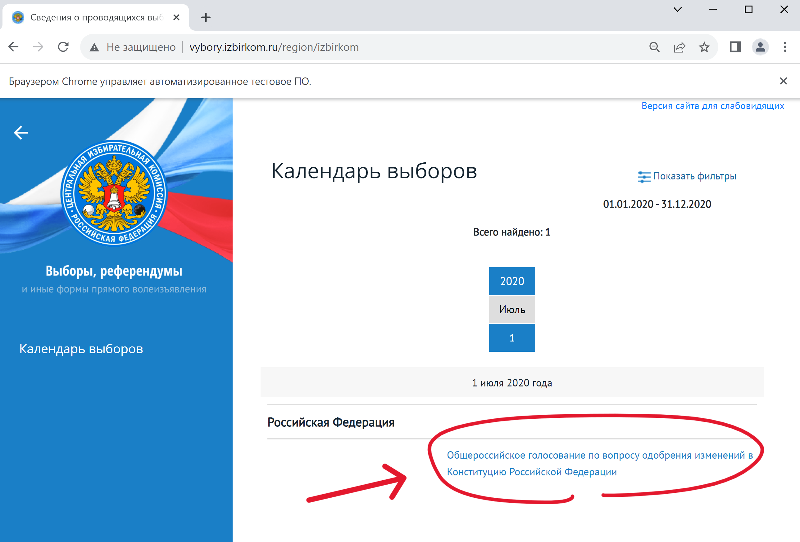

# Parsing Central election commission

---

In this project, I **automatically collected** and **analyzed** data on the results of the largest 
federal elections in the Russian Federation for 2004-2020 and related information 
(turnout, number of spoiled ballots, etc.).

The **Central election commission** (**CEC**) website with the results of elections in Russia 
was used for the collection: http://www.vybory.izbirkom.ru/. This is an official state resource, 
which stores information about the electoral results of all direct types of expression of will 
in the Russian Federation since 2003.

The source has serious _protection against automatic data collection_, so to bypass it the 
combination of `Selenium`, `BeautifulSoup` and `lxml` libraries is used as a technical solution 
for the project, as there are **no restrictions for viewing and reading** any information from the site.

Data is collected at the level of **Territorial Election Commissions** (TECs) or about 
**3 thousand rows** for each of the elections. The following elections are considered: 
* presidential elections in 2004, 2008, 2012, and 2018, 
* and the nationwide vote on constitutional amendments in 2020. 

In addition to the main results of the expression of will (turnout, number and percentage of votes 
for/against or for a particular candidate/against all (relevant for the 2004 elections)), 
other election characteristics are collected that rarely appear in classical research designs 
(number of spoiled ballots, number of absentee ballots issued, etc.). All the data collected have no omissions.

Only a few small changes need to be made to the written code to increase the number of «observations» 
to approximately 90,000 per election — according to the number of **Precinct Election Commissions** (PECs).

The project also provides materials for **processing and analyzing the collected data**.

---

### Project content:
* [data](./data): raw and processed data obtained after parsing and data processing
* [errors](./errors): logs during data collection
* [images](./images): images for [README.md](./README.md)
* [parsing_tools](./parsing_tools): **main code** for parsing the site as separate functions
* [Data-collection.ipynb](./Data-collection.ipynb): **data collection** file
* [Data-processing-and-analysis.ipynb](./Data-processing-and-analysis.ipynb): 
  file with **data processing, data analysis and visualization**
* [requirements.txt](./requirements.txt): project dependency description

---

### Algorithm of data collection (simulation of user behavior with Selenium)

#### 1. Filtering of necessary elections

I open the main page with election results: http://www.vybory.izbirkom.ru/region/izbirkom. 

The logic of its use is organized in such a way that the user immediately sees links to the 
election results for the last month, and in order to get information about older elections, 
it is necessary to select a set of parameters of the elections of interest in the filters. 
Here and further I will use `Selenium` to interact with the site.

Therefore, at the beginning I need to open the section with filters:

A large number of filters about the election will open up for me:

[//]: # ()

Next, I will need to fill in information about the election of interest 
(twice: separately for the amendment election and separately for the presidential election), namely:

* the date range of the election:

[//]: # ()

* election level (federal in my case):

[//]: # ()

* region. As regions, I will always choose a few that have not changed their name during the period 
  under study and in which all the elections of interest to me took place during these years 
  (for example, Moscow and St. Petersburg). It is important to note that at this stage, the choice of 
  region only affects the search for pages-cards of specific election results, from which I can then 
  go to the page of elections for any of the regions in which they took place — thus, the choice of 
  region at this stage does not affect or limit the data collection in the future.\

[//]: # ()

Finally, I need to click on the search button:

[//]: # ()

#### 2. Collecting links to election results by region

The next step is for me to collect links to the results of the elections of interest by regional commissions. 
After the previous step, a list of filtered elections will open in front of me, the links to collect 
(one for amendment elections and four for presidential elections):

[//]: # ()

By clicking on them, I will be presented with an identical interface, where general information 
about the elections will be presented by default. On this page you can see links to the election 
results for each of the regions (as well as in the territories outside the Russian Federation), 
which should be collected and saved separately for further work.

During the research stage of the work I found out that at this stage it is very important to 
separately collect links to the results by regions, and then in a cycle to create a «new»
browser for each of them, rather than iteratively go through them from the general page 
(election card), because in the second case I inevitably encountered captchas even when using 
`Selenium`, and in the first case (i.e. when initializing the browser with a regional link) — never 
had problems with automatic data collection. 
I assume that the site's protection against data collection is arranged in such a way as to scan 
the activity inside the election card when making actions to go in and out of it, and the separate 
opening of links specified inside it (at the moment) is not tracked in any way.

[//]: # ()

#### 3. Collecting data on election results by region

Having saved the links in the previous step, as mentioned above, I will open them, each time 
creating a «new» browser with `Selenium` (and closing the old one).

When first opened, the main results page for the region will again show general election information. 
To get detailed electoral statistics, I will need to click on the button on the left side of the site 
(this functionality is similar for all regions):

[//]: # ()

Next, I need to go to the section with the voting totals summary table:

[//]: # ()

Finally, a table of interest with the results opens up to me:

[//]: # ()

It is interesting that at this stage the site will have a prefix added to the URL: instead of the 
general http://www.vybory.izbirkom.ru, each region will have its own unique prefix, for example, 
http://www.adygei.vybory.izbirkom.ru for the Republic of Adygea, but this does not affect data 
collection in any way.

It is also important to note that although the structure of storing electoral statistics is
always identical within one election, it differs greatly between different elections. On the one hand, 
this facilitates and speeds up data collection for one election, but it forces to write different 
functions for parsing different elections.
